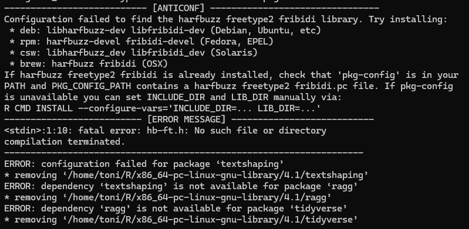

# logtools 

### *imagen del wati. siganlo en instagram: @wati.bakan*

Captura stdout/stderr de procesos de compilación durante la instalación de paquetes R,
incluyendo bloques ANTICONF de dependencias de sistema.

## Instalación

```bash
git clone https://github.com/jcaro.cont/logtools
cd logtools
```

```r
devtools::install(".")
```

## Uso

```r
library(logtools)

install_github.savelog("usuario/repo")
get_anticonf()
```

## ¿Por qué?

En Linux, instalar paquetes R que requieren librerías de sistema falla con un bloque
ANTICONF que indica exactamente qué instalar — pero se pierde en el scroll del log de
compilación.



El bloque te dice el nombre del paquete de sistema para tu distro:

```
-----------------------------[ ANTICONF ]-------------------------------
Configuration failed to find the libv8 engine library. Try installing:
 * deb: libv8-dev or libnode-dev (Debian / Ubuntu)
 * rpm: v8-devel (Fedora, EPEL)
 * brew: v8 (OSX)
------------------------------------------------------------------------
```

Con `logtools` ese bloque se captura y podés recuperarlo después con `get_anticonf()`,
sin perderlo en el output de compilación.

## Funciones disponibles

| Función | Equivalente |
|---|---|
| `install.packages.savelog()` | `base::install.packages()` |
| `install_github.savelog()` | `remotes::install_github()` |
| `install_gitlab.savelog()` | `remotes::install_gitlab()` |
| `install_git.savelog()` | `remotes::install_git()` |
| `install_bioc.savelog()` | `remotes::install_bioc()` |
| `install_bitbucket.savelog()` | `remotes::install_bitbucket()` |
| `install_cran.savelog()` | `remotes::install_cran()` |
| `install_local.savelog()` | `remotes::install_local()` |
| `install_url.savelog()` | `remotes::install_url()` |
| `install_version.savelog()` | `remotes::install_version()` |

## Requisitos

- Debian based os
- `gcc` y `r-base-dev` para compilar el código C
- `remotes` para los wrappers de `install_*`
